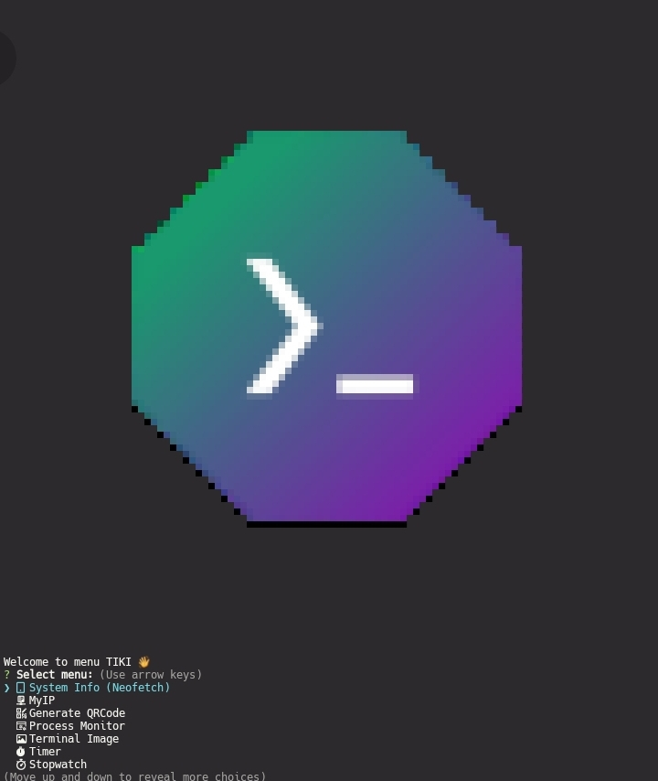

<div align="center">

 # TIKI – Terminal Interactive Knowledge Interface 
 

TIKI is an interactive terminal-based tool that makes it easy to manage, monitor, and execute various functions in Linux/Termux. With TIKI, you can monitor your system, open URLs, create QR codes, perform speed tests, and much more—all from the terminal! 
</div>

## Feature
- **System Monitoring**: View running processes and system information
- **Timer & Stopwatch**: Gunakan timer atau stopwatch interaktif.
- **Tools Utility**:
  - HTTP Header Response
  - My IP Address
  - Generate QR code
  - Speedtest internet
- **Terminal Utilities**:
  - Open URL
  - Terminal Image
  - Termux Color
  - Termux Font
 
## Requirements
- Termux
- NodeJS v20+

## Installation
```bash
$ apt update && apt upgrade -y
$ apt install nodejs git neofetch speedtest-go -y
$ git clone https://github.com/ZeltNamizake/TIKI && cd TIKI
$ npm install
$ node tiki
```
**Note**: It is recommended to use Termux with A-Hack Nerd Font in the "Termux Font" feature for optimal display. 

<div align="center">
  
  
  
  Preview TIKI Menu
</div>

###### Created by  `ZeltNamizake (Driyas)`
